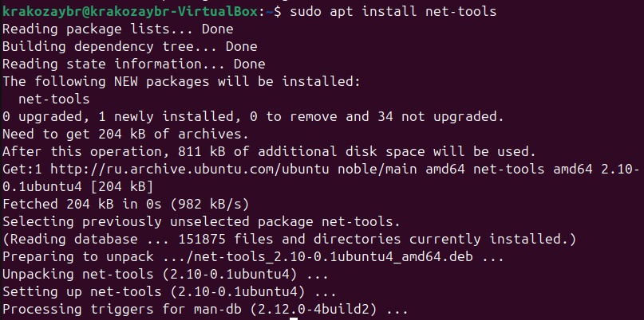
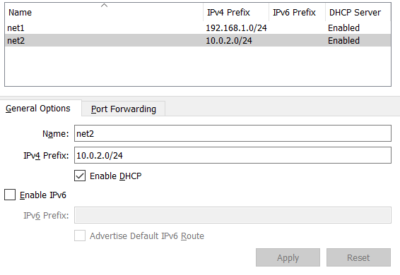
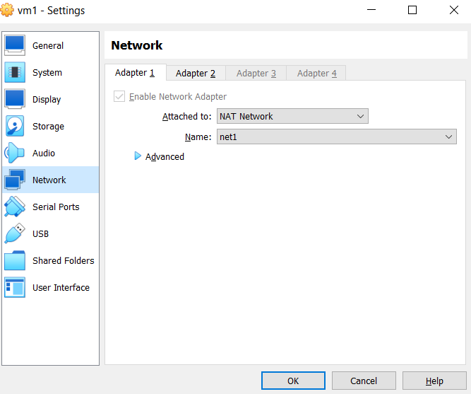
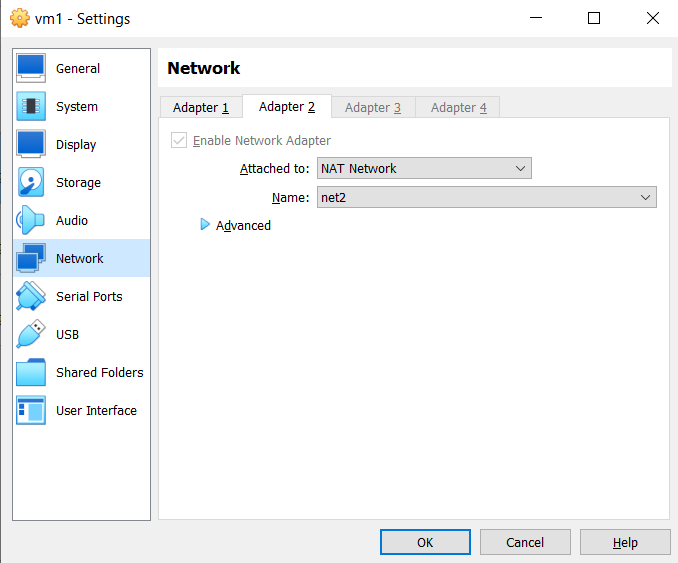
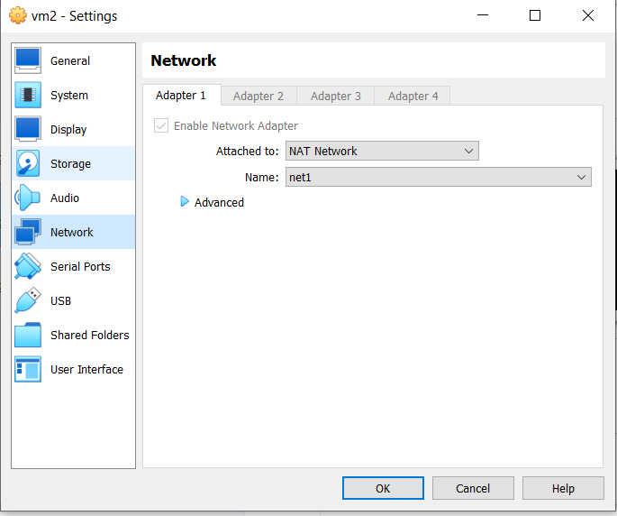
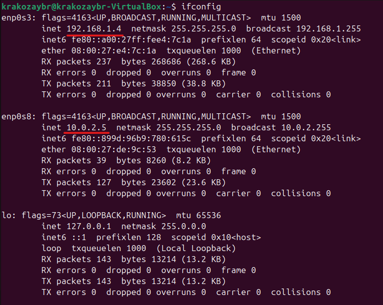
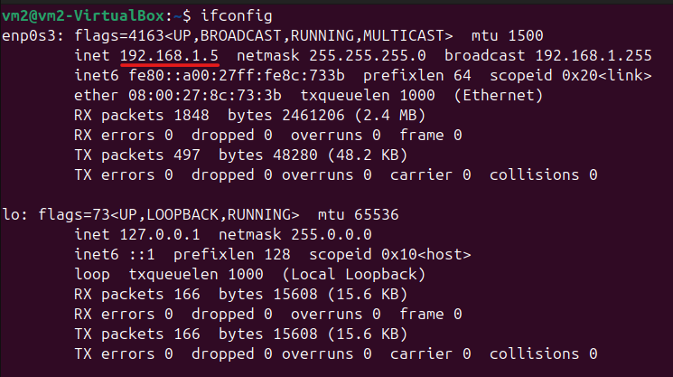
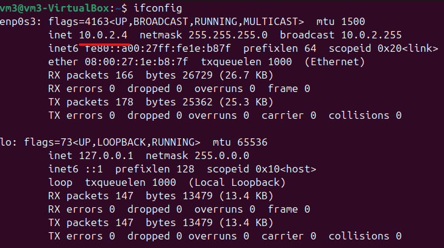
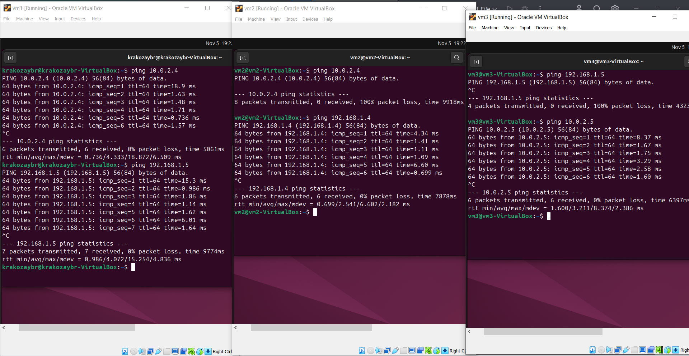

# Лабораторная работа 3

Нам понадобится утилита ifconfig, причем нужно установить её на все три виртуальные машины. Сделаем это:

Замечу, что раз мы смогли её поставить, то интернет на всех из них есть)

Теперь идём в VirtualBox -> File -> Network Manager и создаём там две NAT-сети во вкладке NAT networks:

Подключаем vm1 к обеим из них в Settings -> Network (для этого нужно активировать второй сетевой адаптер):

Подключаем vm2 только к net1:

А vm3 только к net2:

Теперь выполним ifconfig на vm1:

Видим, что у неё есть подключение и к сети net1, и к сети net2. В первой её ip - 192.168.1.4, а во второй - 10.0.2.5

Аналогично выполним команду ipconfig на vm2, её ip в сети net1 будет равен 192.168.1.5:

И на vm3 ip машины в сети net2 будет равен 10.0.2.4

Теперь попробуем запинговать каждую из машин:

Как можно заметить из vm1 можно получить доступ и к vm2, и к vm3 (аналогично - наоборот), но из vm2 нельзя получить доступ к vm3
